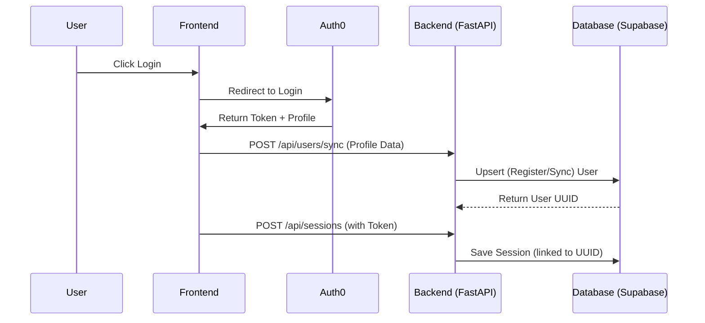

# User Registration & Synchronization Flow

Harmony Helper uses **Auth0** for authentication and a custom **Synchronization Flow** to mirror user profiles in our Supabase database. This ensures that session data is correctly linked to the user's permanent identity.

## 1. Authentication (Frontend)
When a user clicks "Log In":
1. The app redirects to the **Auth0 Hosted Login Page**.
2. Upon successful authentication, Auth0 redirects back to the app with an **Access Token** and user profile data.
3. The `Auth0Provider` (in `App.tsx`) handles the token storage and makes the user state available via the `useAuth0()` hook.

## 2. Token & Profile Sync (`Auth0TokenSync`)
The `Auth0TokenSync` component (rendered globally in `App.tsx`) manages the handoff between Auth0 and our Backend:
- **Token Capture**: It retrieves the JWT Access Token silently and passes it to `storageService.setToken(token)`.
- **User Sync**: It extracts the user profile (`sub`, `email`, `name`, `picture`) and calls `storageService.syncUser(profile)`.

## 3. Registration / Upsert (Backend)
The backend `/api/users/sync` endpoint handles registration automatically:
- **Registration**: If the `auth0_id` (the `sub` field) does not exist in our `users` table, a new record is created.
- **Synchronization**: If the user already exists, their `email`, `name`, and `picture` are updated. This keeps our database in sync with any changes made in Auth0 (e.g., updating a profile picture).
- **Implementation**: We use the Supabase `upsert` command with `on_conflict="auth0_id"`.

```python
# backend/main.py logic
data = {
    "auth0_id": user.sub,
    "email": user.email,
    "name": user.name,
    "picture": user.picture
}
res = supabase.table("users").upsert(data, on_conflict="auth0_id").execute()
```

## 4. Retrieving User Data
Since we use **Row Level Security (RLS)** in Supabase, data retrieval is inherently tied to the user's identity:
- **Authenticated Requests**: All API calls from the frontend include the Auth0 Bearer Token.
- **Session Mapping**: When a user saves a session, the backend looks up their UUID in the `users` table using the `auth0_id` from the payload (or ideally, decoded from the JWT).
- **Security**: Supabase policies ensure that a user can only `SELECT`, `UPDATE`, or `DELETE` records where the `user_id` matches their own ID.

## Summary Diagram

