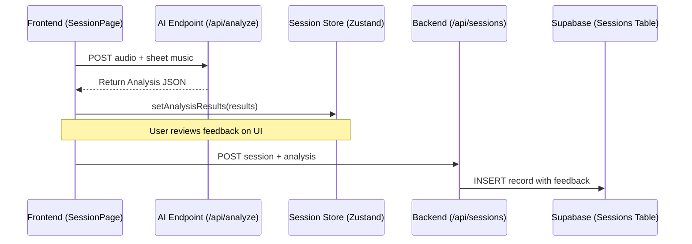

# AI Integration and Feedback Pipeline

This document details the pipeline between the user's practice session, the AI analysis, and the persistent storage of feedback.

## 1. Pipeline Architecture

The feedback loop is a two-stage process designed to separate high-latency AI computation from reliable data persistence.

## 2. AI Specifications

Teammates implementing the AI model should follow the [AI Integration Guide](../../backend/AI_INTEGRATION_GUIDE.md).

### Expected Response Format
The backend expects the AI to return a JSON object containing:
- `performace_summary`: A general critique.
- `coach-feedback`: Specific practice advice.
- `marked-up-musicxml`: (Optional) Sheet music with error highlights.

## 3. Data Flow and Persistence

### Phase 1: Temporary Capture
When the AI returns its results, they are held in the `currentSession` state within the `useSessionStore`. This allows the user to view the feedback immediately on the **Feedback Page** without waiting for a database write.

### Phase 2: Perpetual Storage
When the user finishes the session (clicks "Save"):
1. The `ApiStorageService` bundles the `analysis` object from the store into the POST payload.
2. The FastAPI `save_session` endpoint maps these keys to the database columns:
    - `"analysis_summary": session.analysis["performace_summary"]`
    - `"analysis_feedback": session.analysis["coach-feedback"]`
3. These are stored in the `sessions` table alongside the `song_name`, `duration`, and `audio_url`.

### Phase 3: Historical Retrieval
When the **History Page** is loaded, the `ApiStorageService` performs "Reverse Mapping." It takes the flat database columns (`analysis_summary`, `analysis_feedback`) and reconstructs the structured `analysis` object. This enables the "View Feedback" modal to display historical advice exactly as it appeared on the day of the session.
